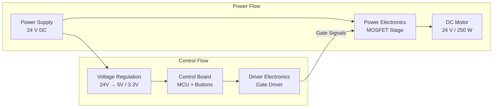

# Blockdiagram seperated in Power and Signal Flow

```mermaid
flowchart LR

    subgraph Power_Flow [Power Flow]
        PS[Power Supply\n24 V DC]
        PE[Power Electronics\nMOSFET Stage]
        M[DC Motor\n24 V / 250 W]

        PS --> PE --> M
    end

    subgraph Control_Flow [Control Flow]
        VR[Voltage Regulation\n24V → 5V / 3.3V]
        MCU[Control Board\nMCU + Buttons]
        DRV[Driver Electronics\nGate Driver]

        VR --> MCU --> DRV
    end

    PS --> VR
    DRV -->|Gate Signals| PE
```
